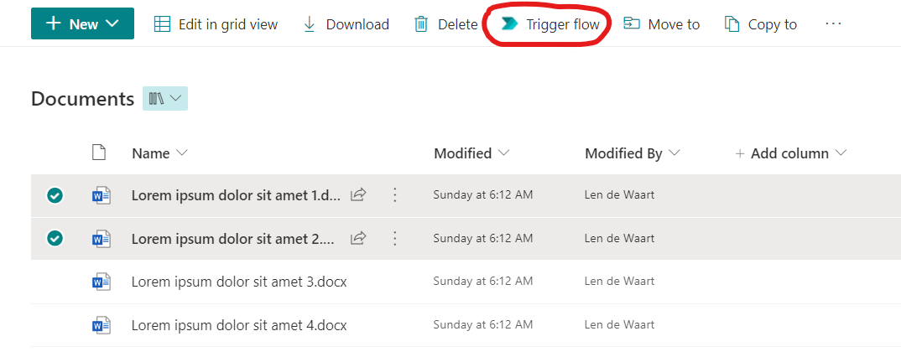
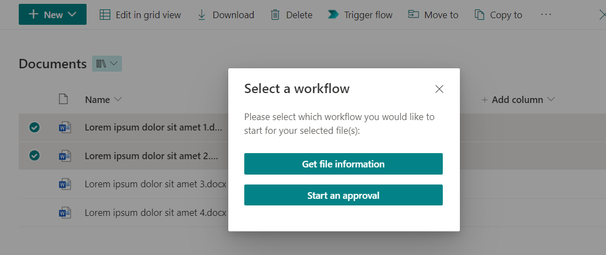
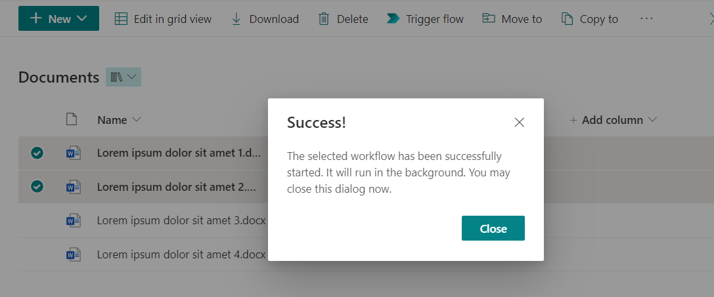
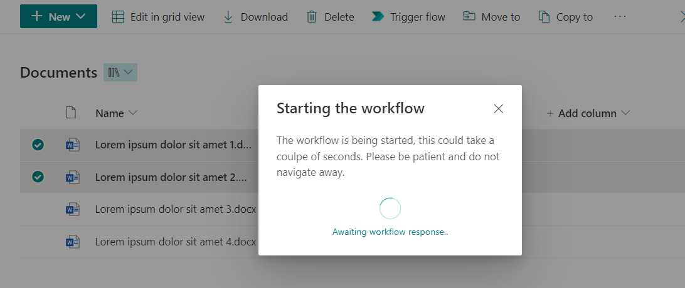
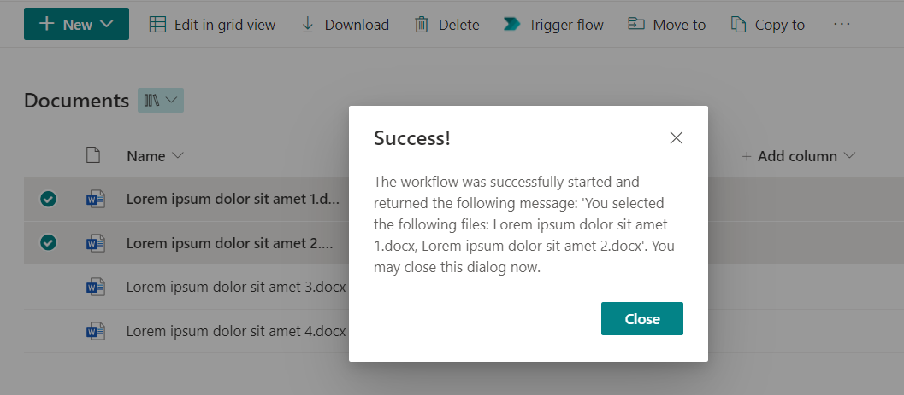

#  Enhanced Power Automate Trigger Command Set

## Table of Contents
  - [Summary](#summary)
  - [Compatibility](#compatibility)
  - [Applies to](#applies-to)
  - [Prerequisites](#prerequisites)
  - [Solution](#solution)
  - [Version history](#version-history)
  - [Supported languages](#supported-languages)
  - [How it works](#how-it-works)
  - [Download the web part packages](#download-the-web-part-packages)

## Summary

My colleague [MrAutomate33](https://github.com/mrautomate33) and I have been longing for a solution that supports triggering Power Automate flows while selecting multiple files in a SharePoint document library or multiple list items in a SharePoint custom list. Now, finally it's here! <br />
<br />
This SPFx (SharePoint Framework) command set expands on the existing 'trigger a flow' menu button in SharePoint, and allows you to configure one or more HTTP request triggered flows and serve the user with a choice on which flow to execute when selecting one or more items by injecting a menu button upon loading the page. The command set is compatible with both SharePoint document libaries and custom lists.

**[<u>Download the .sppkg file for custom lists here!</u>](https://github.com/cupo365/enhanced-power-automate-command-set/releases/tag/v1.0.0)**

**[<u>Download the .sppkg file for document libraries here!</u>](https://github.com/cupo365/enhanced-power-automate-command-set/releases/tag/v1.0.0)**

## Compatibility

 


  -Incompatible-red.svg)

 

## Applies to

- [SharePoint Framework](https://aka.ms/spfx)
- [Power Automate](https://powerautomate.microsoft.com/en-us/)
- [Microsoft 365 tenant](https://docs.microsoft.com/en-us/sharepoint/dev/spfx/set-up-your-developer-tenant)
- [Elegant DI in SPFx](https://ypcode.wordpress.com/2018/07/30/elegant-di-in-spfx/)
- [Provision SharePoint assets from your client-side web part](https://docs.microsoft.com/en-us/sharepoint/dev/spfx/web-parts/get-started/provision-sp-assets-from-package)

## Prerequisites

> - Node.js v10/12/14
> - A Power Automate per user or per flow plan that allows you to use the Request (HTTP) connector (see [Power Automate pricing](https://powerautomate.microsoft.com/en-us/pricing/))
> - (optional) An M365 account. Get your own free Microsoft 365 tenant from [M365 developer program](https://developer.microsoft.com/en-us/microsoft-365/dev-program)

## Solution

| Solution                                                       | Author(s)                                     |
| -------------------------------------------------------------- | --------------------------------------------- |
| Document Libraries Enhanced Power Automate Trigger Command Set | cup o'365 ([contact](mailto:info)             |
| Custom Lists Enhanced Power Automate Trigger Command Set       | cup o'365 ([contact](mailto:info@cupo365.gg)) |

## Version history

| Version | Date          | Comments                                         |
| ------- | ------------- | ------------------------------------------------ |
| 0.9.0   | April 3, 2022 | Pre-release                                      |
| 1.0.0   | July 1, 2022  | Initial release, doc lib and lists compatibility |
| 1.0.1   | July 24, 2022 | Optimalizations, code and structure refactoring  |

## Supported languages
- English
- Dutch

---

## How it works

Unlike SPFx web parts, command sets do not support configuration via a property panel. To ensure customization to this solution is still possible, a workaround has been implemented. 

Upon installing the web part on a SharePoint site, a Power Automate trigger configuration custom list will be automatically provisioned with the name ````Enhanced Power Automate Trigger Configuration````.

Upon initialization, the web part will fetch all items in this provisioned list and use the information stored in it to create flow configuration, which is then presented to the user as a choice which flow to trigger. If the web part succeeds in fetching and composing the configuration, a console message will be written with the name of the provisioned list. This message looks like ````EnhancedPowerAutomateTriggerCommandSet -> Initialized! Listening to config list: Enhanced Power Automate Trigger Configuration````.
If it fails, a console message will be written. This message looks like ````EnhancedPowerAutomateTriggerCommandSet -> Error while initializing````.

The web part will call the flow by using the information in the composed flow configuration selected by the user.
The provisioned configuration list contains the following  fields. Each item in this list represents a flow the user should be able to call from the list/document library:

| Name        | Type                | Description                                                                                                                                                           | Example                                                                                                                                                                                                                               |
| ----------- | ------------------- | --------------------------------------------------------------------------------------------------------------------------------------------------------------------- | ------------------------------------------------------------------------------------------------------------------------------------------------------------------------------------------------------------------------------------- |
| Title       | single line of text | The text that will be shown to the user upon selecting a workflow to trigger                                                                                          | "Start an approval"                                                                                                                                                                                                                   |
| Trigger URL | single line of text | The URL by which the flow can be triggered via an HTTP request                                                                                                        | "https://prod-162.westeurope.logic.azure.com:443/workflows/0d63b7042722453cbb6764df2ebfb64a/triggers/manual/paths/invoke?api-version=2016-06-01&sp=%2Ftriggers%2Fmanual%2Frun&sv=1.0&sig=ida8j_yD_PyXWbJwSJvAEX7JiCh_ruuqWb5LqXrH3Tw" |
| HTTP Type   | choice              | The request method that should be used to trigger the flow. Only POST is a valid entry here since it's the only method in Power Automate that supports request bodies | "POST"                                                                                                                                                                                                                                |

If the command set is installed on the site and the user opens a document library or custom list (depending on the installed package) and one or more items are selected, a menu button with the text 'Trigger flow' will become visible in the menu bar (see example below). 


Upon pressing the menu button, a dialog will appear, displaying choices for every configured flow in the provisioned configuration list. The user will be able to choose which flow they want to trigger (see example below).

> Note that the web part and its components is SharePoint theme-aware.

If the configured flow uses a POST method, the command set will pass a request body JSON-object to the flow with the following properties:
| Name             | Type    | Description                                                                   | Example                                                          |
| ---------------- | ------- | ----------------------------------------------------------------------------- | ---------------------------------------------------------------- |
| site             | string  | The site on which the command set resides                                     | "https://cupo365.sharepoint.com/sites/mkvj"                      |
| tenantUrl        | string  | The SharePoint tenant URL                                                     | "https://cupo365.sharepoint.com/"                                |
| listId           | string  | The guid of the SharePoint list from which the web part was invoked           | "e74d4d74-e145-42ea-9f74-26aa22565dfa"                           |
| culture          | string  | The configured language by the user of the web part (culture variant UI name) | "en-US"                                                          |
| selectedItems    | array   | An array of selected item objects                                             | -                                                                |
| id               | integer | The ID of the selected item                                                   | 3                                                                |
| fileRef          | string  | the server relative URL                                                       | "/sites/mkvj/Shared Documents/Lorem ipsum dolor sit amet 1.docx" |
| fileLeafRef      | string  | The name of the file, including the file extension                            | "Lorem ipsum dolor sit amet 1.docx"                              |
| fileType         | string  | The file type                                                                 | "docx"                                                           |
| uniqueIdentifier | string  | The unique guid of the selected item                                          | "{7e88549e-6d26-4f7f-bdd3-17919a7526e9}"                         |

An example of the request body is outlined below:
````
{
  "site": "https://cupo365.sharepoint.com/sites/mkvj",
  "tenantUrl": "https://cupo365.sharepoint.com/",
  "listId": "e74d4d74-e145-42ea-9f74-26aa22565dfa",
  "culture": "en-US",
  "selectedItems": [
      {
          "id": 3,
          "fileRef": "/sites/mkvj/Shared Documents/Lorem ipsum dolor sit amet 1.docx",
          "fileLeafRef": "Lorem ipsum dolor sit amet 1.docx",
          "fileType": "docx",
          "uniqueIdentifier": "{7e88549e-6d26-4f7f-bdd3-17919a7526e9}"
      },
      {
          "id": 2,
          "fileRef": "/sites/mkvj/Shared Documents/Lorem ipsum dolor sit amet 2.docx",
          "fileLeafRef": "Lorem ipsum dolor sit amet 2.docx",
          "fileType": "docx",
          "uniqueIdentifier": "{47bd54ff-6a37-4873-934b-47fd3da89161}"
      }
  ]
}
````

This request body translates to the following Power Automate body schema:
````
{
    "type": "object",
    "properties": {
        "site": {
            "type": "string"
        },
        "tenantUrl": {
            "type": "string"
        },
        "listId": {
            "type": "string"
        },
        "culture": {
            "type": "string"
        },
        "selectedItems": {
            "type": "array",
            "items": {
                "type": "object",
                "properties": {
                    "id": {
                        "type": "integer"
                    },
                    "fileRef": {
                        "type": "string"
                    },
                    "fileLeafRef": {
                        "type": "string"
                    },
                    "fileType": {
                        "type": "string"
                    },
                    "uniqueIdentifier": {
                        "type": "string"
                    }
                },
                "required": [
                    "id",
                    "fileRef",
                    "fileLeafRef",
                    "fileType",
                    "uniqueIdentifier"
                ]
            }
        }
    }
}
````
> Note that flows configured with a GET method <u>will not</u> receive a request body, since that is not supported within the Power Automate response (HTTP) trigger.

<br />
The command set supports both waiting for a flow response and simple invocations without waiting for a response.
<br />
<br />
If the flow does not contain a custom response, it will show the following message to the user:



If the flow does contain a custom response, the command set will wait and show the user a message, based on the response. 



The command set also supports showing the user a custom message via the flow response body (optional). The command set supports the following response body:
````
{
  "message": "Any message here"
} 
````

This translates to the following Power Automate body schema:
````
{
    "type": "object",
    "properties": {
        "message": {
            "type": "string"
        }
    }
}
````

If a message is present, it will be displayed in the dialog that is shown to the user (see example below).


Once the user closes the dialog, the page will be refreshed.

## Download the web part packages

**[<u>Download the .sppkg file for custom lists here!</u>](https://github.com/cupo365/enhanced-power-automate-command-set/releases/tag/v1.0.0)**

**[<u>Download the .sppkg file for document libraries here!</u>](https://github.com/cupo365/enhanced-power-automate-command-set/releases/tag/v1.0.0)**
