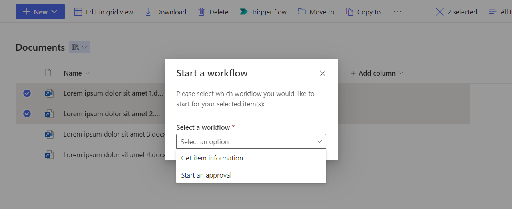

#  Enhanced Power Automate Trigger Command Set

## Table of Contents
  - [Summary](#summary)
  - [Used SharePoint Framework Version](#used-sharepoint-framework-version)
  - [Applies to](#applies-to)
  - [Prerequisites](#prerequisites)
  - [Solution](#solution)
  - [Version history](#version-history)
  - [Supported languages](#supported-languages)
  - [How to implement](#how-to-implement)

## Summary

My colleague [MrAutomate33](https://github.com/mrautomate33) and I have been longing for a solution that supports triggering Power Automate flows while selecting multiple files in a SharePoint document library. Now, finally it's here! <br />
<br />
This SPFx (SharePoint Framework) command set improves on the existing 'trigger a flow' menu button in SharePoint, and allows you to configure one or more HTTP request triggered flows and serve the user with a choice on which flow to execute when selecting one or more files in a SharePoint document library by injecting a menu button upon loading the page. The command set <u>only applies to SharePoint document libraries.</u>

**[<u>Download the .sppkg file here!</u>](sharepoint/solution/enhanced-power-automate-trigger.sppkg)**

## Used SharePoint Framework Version


## Applies to

- [SharePoint Framework](https://aka.ms/spfx)
- [Power Automate](https://powerautomate.microsoft.com/en-us/)
- [Microsoft 365 tenant](https://docs.microsoft.com/en-us/sharepoint/dev/spfx/set-up-your-developer-tenant)
- [Elegant DI in SPFx](https://ypcode.wordpress.com/2018/07/30/elegant-di-in-spfx/)

## Prerequisites

> - Node.js v10/12/14
> - A Power Automate per user or per flow plan that allows you to use the HTTP connector (see [Power Automate pricing](https://powerautomate.microsoft.com/en-us/pricing/))
> - (optional) An M365 account. Get your own free Microsoft 365 tenant from [M365 developer program](https://developer.microsoft.com/en-us/microsoft-365/dev-program)

## Solution

Solution|Author(s)
--------|---------
Enhanced Power Automate Trigger Command Set | cup o'365 ([Contact](mailto:info@cupo365.gg), [Website](https://cupo365.gg))

## Version history

Version|Date|Comments
-------|----|--------
1.0|April 3, 2022|Initial release

## Supported languages
- English
- Dutch

---

## How to implement

Unlike SPFx webparts, command sets do not support configuration via a property panel. To ensure customization to this solution is still possible, a workaround has been implemented. 

By default, upon initialization the command set fetches configuration from a SharePoint list on the root of the SharePoint domain, and with a pre-configured title. The steps to setup this SharePoint list correctly are displayed below:
1. Create a custom list on the root of the SharePoint domain. _Example: the root of https://cupo365.sharepoint.com/sites/mkvj is https://cupo365.sharepoint.com_
2. Give it the following title: ````Enhanced Power Automate Trigger Configuration````
3. Add a multiple lines of text field in the list settings. Give the field the following name: ````Flows````
4. Enter the flow configuration in this field

The flow configuration is an array of JSON-objects in which every object is an HTTP request triggered flow. See the table below for an explanation of every property in these JSON-objects as wel as an example.
Name|Type|Description|Example
-------|----|--------|--------
actionName|string|The text that will be shown to the user upon selecting a workflow to trigger|"Start an approval"
trigger|object|An object with flow trigger specific information|-
url|string|The URL on which the flow can be triggered by an HTTP request|"https://prod-162.westeurope.logic.azure.com:443/workflows/0d63b7042722453cbb6764df2ebfb64a/triggers/manual/paths/invoke?api-version=2016-06-01&sp=%2Ftriggers%2Fmanual%2Frun&sv=1.0&sig=ida8j_yD_PyXWbJwSJvAEX7JiCh_ruuqWb5LqXrH3Tw"
method|string|The request method that should be used to trigger the flow. Only POST or GET is a valid entry here|"POST"

An example of the flow configuration for two HTTP request triggered flows is outlined below:

````
[
  {
    "actionName": "Get file information",
    "trigger": {
      "url": "https://prod-164.westeurope.logic.azure.com:443/workflows/0d63b7042722453cbb6764df2ebfb64a/triggers/manual/paths/invoke?api-version=2016-06-01&sp=%2Ftriggers%2Fmanual%2Frun&sv=1.0&sig=ida8j_fE_dfdgrRGRrhrtBYTHRTntyjyr",
      "method": "POST"
    }
  },
  {
    "actionName": "Start an approval",
    "trigger": {
      "url": "https://prod-01.westeurope.logic.azure.com:443/workflows/4d22a802a0ea680ab722dfe7f0156d47/triggers/manual/paths/invoke?api-version=2016-06-01&sp=%2Ftriggers%2Fmanual%2Frun&sv=1.0&sig=X9butfhsrmYJo-1Gm8iAbsIrtgYgA4dztWWQGGanfv8",
      "method": "POST"
    }
  }
]
````

Upon initialization, the command set will attempt to fetch this configuration. If it succeeds, a console message will be written with the name of the configuration list. This message looks like ````EnhancedPowerAutomateTriggerCommandSet -> Initialized! Listening to config list: Enhanced Power Automate Trigger Configuration````.
If it fails, a console message will be written. This message looks like ````EnhancedPowerAutomateTriggerCommandSet -> Error while initializing````.

If the command set is installed on the site and the user opens a document library and one or more files are selected, a menu button with the text 'Trigger flow' will become visible in the menu bar (see example below). 


Upon pressing the menu button, a dialog will appear, displaying buttons for every configured HTTP request triggered flow. The user will be able to choose which flow they want to trigger (see example below).


If the configured flow uses a POST method, the command set will pass a request body JSON-object to the flow with the following properties:
Name|Type|Description|Example
-------|----|--------|--------
site|string|The site on which the command set resides|"https://cupo365.sharepoint.com/sites/mkvj"
tenantUrl|string|The SharePoint tenant URL|"https://cupo365.sharepoint.com/"
selectedFiles|array|An array of selected file objects|-
id|integer|The ID of the selected file|3
fileRef|string|the server relative URL|"/sites/mkvj/Shared Documents/Lorem ipsum dolor sit amet 1.docx"
fileLeafRef|string|The name of the file, including the file extension|"Lorem ipsum dolor sit amet 1.docx"
fileType|string|The file type|"docx"
editor|string|The email address of the file editor|"lwa@mkvj.onmicrosoft.com"

An example of the request body is outlined below:
````
{
  "site": "https://cupo365.sharepoint.com/sites/mkvj",
  "tenantUrl": "https://cupo365.sharepoint.com/",
  "selectedFiles": [
      {
          "id": 3,
          "fileRef": "/sites/mkvj/Shared Documents/Lorem ipsum dolor sit amet 1.docx",
          "fileLeafRef": "Lorem ipsum dolor sit amet 1.docx",
          "fileType": "docx",
          "editor": "lwa@mkvj.onmicrosoft.com"
      },
      {
          "id": 2,
          "fileRef": "/sites/mkvj/Shared Documents/Lorem ipsum dolor sit amet 2.docx",
          "fileLeafRef": "Lorem ipsum dolor sit amet 2.docx",
          "fileType": "docx",
          "editor": "lwa@mkvj.onmicrosoft.com"
      }
  ]
}
````

This request body translates to the following Power Automate body schema:
````
{
    "type": "object",
    "properties": {
        "site": {
            "type": "string"
        },
        "tenantUrl": {
            "type": "string"
        },
        "selectedFiles": {
            "type": "array",
            "items": {
                "type": "object",
                "properties": {
                    "id": {
                        "type": "integer"
                    },
                    "fileRef": {
                        "type": "string"
                    },
                    "fileLeafRef": {
                        "type": "string"
                    },
                    "fileType": {
                        "type": "string"
                    },
                    "editor": {
                        "type": "string"
                    }
                },
                "required": [
                    "id",
                    "fileRef",
                    "fileLeafRef",
                    "fileType",
                    "editor"
                ]
            }
        }
    }
}
````
> Note that flows configured with a GET method <u>will not</u> receive a requets body, since that is not supported within the used HTTP client.

<br />
The command set supports both waiting for a flow response and simple invocations without waiting for a response.
<br />
<br />
If the flow does not contain a custom response, it will show the following message to the user:


If the flow does contain a custom response, the command set will wait and show the user a message, based on the response. 


The command set also supports showing the user a custom message via the flow response body (optional). The command set supports the following response body:
````
{
  "message": "Any message here"
} 
````

This translates to the following Power Automate body schema:
````
{
    "type": "object",
    "properties": {
        "message": {
            "type": "string"
        }
    }
}
````

If a message is present, it will be displayed in the dialog that is shown to the user (see example below).


Once the user closes the dialog, the page will be refreshed.

**[<u>Download the .sppkg file here!</u>](sharepoint/solution/enhanced-power-automate-trigger.sppkg)**
